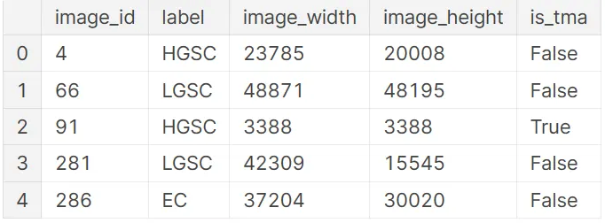

Ovarian carcinoma is a lethal cancer of the female reproductive system. 5 common subtypes and several rare subtypes(outliers)

The goal of the UBC Ovarian Cancer Subtype classification and outlier detection competition is to build a model trained on the dataset of histopathology images from many medical centers.

The Kaggle Competition aims to solve challenges：
    
* The disagreements between observers and the reproducibility of diagnostics

* Underserved communities lack access to specialist pathologists (also a shortage in well-developed comunities)


## Main idea (Algorithm used)

1. The training data provided in this competition are extremely large-sized medical imaging pictures. Our team use the approach of Multi-Instance Learning (which determines the category of an individual by using multiple instance images within a single individual) to solve this image classification problem.

2. **Image cutting:** First, cut the images into multiple small fragments. At the same time, perform certain scale scaling and remove the image instances where the background takes up too much space.

3. **Image staining:** Since the test set contains images from different sources of medical processing, to reduce the color distribution differences, use staining tools to color the cut images, obtaining various stained images.

4. **Training:** Conduct end-to-end training on a single small image (including the stained images). During the training process, use various image augmentation methods (augment) to obtain a trained classification model.

5. **Inference (ensemble learning):** Cut the images in the test set with the same methods, perform inference on each cut image one by one. Sum up the prediction results obtained from the inference of each set of images, and then take the label of the maximum value after softmax as the final classification result. 

Model we tried: Efficientnet-B6、Efficientnetv2-L、seresnextaa101d_32x8d、resnest200e

### multi-instance learning
There are usually one or more instances that affect the labels of a package. For packages with positive tags, at least one instance is positive; For packages with negative labels, all instances are negative. The purpose of the learning is to identify which instances contribute to the labeling of the package.

An image can be divided into multiple areas (instances), and the diagnostic results of the entire image are labeled by the package. We may not know exactly which area has the tumor, but if the imaging is diagnosed as diseased, then at least one area is abnormal.


### Challenges and Future Improvement
The PNG image format posed a major challenge: loading large PNG images with standard libraries (Pillow, OpenCV) was time consuming and used a lot of RAM. Standard formats in digital pathology (SVS, TIFF, NDPI) store data pyramidally to prevent the need for loading the entire images into RAM. Although Kaggle staff members acknowledged that PNG format was a bad choice, pyramidal images were not made available to the participants.


Our approach is relatively simple, using an end-to-end training approach that uses machines to automatically extract features. But this is also the downside, I see the top few ideas are to extract features separately

## Exploratory Data Analysis

### Data Collection:

    Begin by obtaining the UBC-OCEAN dataset, import te dataset into a preferred data analysis environment(pandas, numpy, matplotlib or visualization)

### Initial Exploration:
1 - Start by examining the basic characteristics of the data:

```
Check the first few rows using df.head().
Check the data types and missing values using df.info().
Calculate basic statistics using df.describe().
Data Cleaning:
```

2 - Handle missing values, outliers, and duplicates:

```
Use techniques like imputation for missing values.
Identify and deal with outliers appropriately.
Remove duplicate rows if necessary.
```

3 - Data Visualization:

```
Create visualizations to gain insights into the data:
Histograms and box plots for numerical features.
Bar plots for categorical features.
Correlation matrix and scatter plots to understand relationships between variables.
```

4 - Feature Analysis:
```
Explore relationships between features and the target variable(s) for classification and outlier detection.
Visualize how different features vary across different subtypes or classes.
Use box plots, violin plots, or swarm plots to compare feature distributions.
```

5 - Outlier Detection:

```
If dataset contains information related to outlier detection, perform a dedicated EDA for this aspect:
Visualize outliers using scatter plots or box plots.
Apply statistical methods or machine learning techniques to identify outliers.
```

6 - Dimensionality Reduction (optional):

```
If the dataset has many features, consider dimensionality reduction techniques like Principal Component Analysis (PCA) to reduce the number of variables while preserving important information.
```

7 - Summary and Insights:

```
Summarize your findings from the EDA, including any patterns, trends, or anomalies observed.
Document any data preprocessing steps applied.
```


### Finding

1. The image resolution is very large and requires additional preprocessing; 
2. The picture in the competition, some images' length and width can reach 40,000 pixels. If it is compressed to 512\*512 or 1024\*1024, the effect is definitely not good.

So, we have to consider "How to convert to a small size image and retain the information of the original image?"



-------

3. The distribution is not extremely uneven


----

4. Many areas are useless areas(black area) that can be pre-processed for cutting and cropping of images

